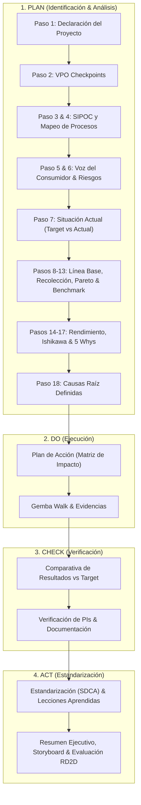

# 🏭 MAZ HUB — Young Talent PDCA & Continuous Improvement Platform

[](https://react.dev/)
[](https://www.typescriptlang.org/)
[](https://tanstack.com/)
[](https://tailwindcss.com/)
[](https://firebase.google.com/)

**MAZ HUB** es una plataforma web corporativa diseñada para la gestión, seguimiento y evaluación de metodologías de mejora continua (**PDCA**, **RDA**, **Árbol de KPIs** y **Tableros Kanban**) para el programa _Young Talents_ y equipos de operaciones industriales en Grupo Modelo.

---

## 📑 Tabla de Contenidos

1. [Características Principales](#-características-principales)
2. [Arquitectura y Estructura del Proyecto](#-arquitectura-y-estructura-del-proyecto)
3. [Flujo Detallado de la Metodología PDCA](#-flujo-detallado-de-la-metodología-pdca)
4. [Stack Tecnológico](#-stack-tecnológico)
5. [Variables de Entorno](#-variables-de-entorno)
6. [Instalación y Uso Local](#-instalación-y-uso-local)
7. [Scripts Disponibles](#-scripts-disponibles)
8. [Despliegue (Deploy)](#-despliegue-deploy)
9. [Seguridad y Roles](#-seguridad-y-roles)
10. [Buenas Prácticas de Contribución](#-buenas-prácticas-de-contribución)

---

## 🚀 Características Principales

- **Gestión Integral de Proyectos PDCA**:
  - Implementación completa de los 4 pilares: **Plan**, **Do**, **Check**, **Act**, más **Resumen Ejecutivo** y **Evaluación RD2D**.
  - Más de 18 pasos metodológicos interactivos: SIPOC, Mapeo de Procesos, Gráficas Target vs Actual YTD, Análisis de Pareto con Drill-Downs multinivel, Diagrama de Ishikawa (Causa-Efecto), Análisis de 5 Porqués (5 Whys), y Matriz de Impacto/Esfuerzo.
- **Módulo RDA (Rutina Diaria de Análisis)**:
  - Registro, seguimiento diario y estandarización de anomalías y causas operativas.
- **Árbol de KPIs y Visualización de Métricas**:
  - Árbol jerárquico interactivo (`@xyflow/react`) para trazar dependencias entre métricas globales e indicadores de proceso (PIs).
- **Tablero Action Kanban**:
  - Gestión visual de planes de acción con Drag & Drop fluido (`@dnd-kit`).
- **Exportación de Reportes en PDF de Alta Fidelidad**:
  - Generación automática de reportes ejecutivos usando `@react-pdf/renderer` y `html2pdf.js`.
- **Persistencia en la Nube y Soporte Offline**:
  - Sincronización en tiempo real mediante **Firebase Firestore** con caché offline multi-pestaña (`persistentLocalCache`).
  - Almacenamiento multimedia seguro en **Firebase Storage** para evidencias y documentación gráfica.
- **Panel Administrativo**:
  - Administración de usuarios, asignación de roles y creación de cuentas sin interrumpir la sesión activa mediante instancias secundarias de autenticación.

---

## 📂 Arquitectura y Estructura del Proyecto

El código está organizado de forma modular y desacoplada bajo el directorio `src/`:

```plaintext
MAZ-HUB/
├── public/                     # Recursos estáticos y branding corporativo
├── src/
│   ├── components/             # Componentes de interfaz de usuario
│   │   ├── 1.PLAN/             # Subfases y pasos de la fase PLAN (Pasos 1 al 18)
│   │   │   ├── paso1/          # Declaración del proyecto y definición de metas
│   │   │   ├── paso2/          # Checkpoints VPO
│   │   │   ├── paso7/          # Situación Actual / Series de Tiempo YTD
│   │   │   ├── paso9/          # Plan de recolección de datos
│   │   │   ├── paso10/         # Diagrama de Pareto interactivo y Drill-down
│   │   │   ├── paso11/         # Correlación de variables / flavors
│   │   │   ├── paso14/         # Rendimiento actual y evidencias por indicador
│   │   │   ├── paso15/         # GOP Themes
│   │   │   ├── paso16/         # Diagrama de Ishikawa y matriz de priorización
│   │   │   └── paso17/         # Análisis de 5 Porqués interactivo
│   │   ├── 2.DO/               # Fase DO: Matriz de plan de acción y Gemba Walk
│   │   ├── 3.CHECK/            # Fase CHECK: Verificación de resultados y gráficas
│   │   ├── 4.ACT/              # Fase ACT: Estandarización y cierre
│   │   ├── EVALUACION RD2D/    # Criterios de evaluación y scorecards
│   │   ├── RESUMEN/            # Storyboard y síntesis ejecutiva
│   │   ├── RDA/                # Módulo y componentes de Rutina Diaria de Análisis
│   │   ├── admin/              # Componentes de gestión administrativa y usuarios
│   │   ├── auth/               # Formularios y guardas de autenticación
│   │   ├── image-upload/       # Componentes de subida simple y múltiple de imágenes/PDFs
│   │   ├── layout/             # Encabezados, barra lateral (AppSidebar) y contenedores
│   │   └── ui/                 # Componentes base shadcn/ui (Botones, Modales, Tablas, etc.)
│   ├── context/                # Contextos globales de React (AuthContext, PdcaContext)
│   ├── data/                   # Tipos TypeScript, interfaces y esquemas de datos (pdca.ts)
│   ├── hooks/                  # Custom React Hooks reutilizables
│   ├── lib/                    # Configuración de Firebase, utilidades y helpers
│   ├── routes/                 # Enrutamiento basado en archivos (TanStack Router)
│   │   ├── __root.tsx          # Layout raíz y proveedores globales
│   │   ├── index.tsx           # Vista principal (Listado de PDCAs y filtros)
│   │   ├── dashboard.tsx       # Tablero de control de métricas globales
│   │   ├── admin.tsx           # Panel de administración
│   │   ├── rda.tsx             # Vista del módulo RDA
│   │   └── login.tsx           # Inicio de sesión
│   ├── services/               # Capa de servicios para comunicación con Firebase/Firestore
│   └── styles.css              # Estilos globales y tokens de diseño Tailwind CSS v4
├── firebase.json               # Configuración de hosting y rewrites de Firebase
├── vite.config.ts              # Configuración de Vite y plugins
└── package.json                # Dependencias y scripts del proyecto
```

---

## 🔍 Flujo Detallado de la Metodología PDCA



---

## 🛠 Stack Tecnológico

| Capa                     | Tecnología                                                                                                                | Propósito                                                                         |
| :----------------------- | :------------------------------------------------------------------------------------------------------------------------ | :-------------------------------------------------------------------------------- |
| **Framework / Runtime**  | [React 19](https://react.dev/) + [TypeScript](https://www.typescriptlang.org/)                                            | Entorno declarativo y fuertemente tipado.                                         |
| **Enrutador & Servidor** | [TanStack Router](https://tanstack.com/router) & [TanStack Start](https://tanstack.com/start)                             | Enrutamiento robusto basado en sistema de archivos con tipado seguro.             |
| **Estilos & UI**         | [Tailwind CSS v4](https://tailwindcss.com/) + [shadcn/ui](https://ui.shadcn.com/) / [Radix UI](https://www.radix-ui.com/) | Sistema de diseño corporativo moderno y accesible.                                |
| **Backend & Cloud**      | [Firebase](https://firebase.google.com/) (Auth, Firestore, Storage)                                                       | Base de datos NoSQL reactiva en tiempo real, autenticación y storage de archivos. |
| **Gráficas & Diagramas** | [Recharts](https://recharts.org/) + [@xyflow/react](https://reactflow.dev/)                                               | Visualización de datos estadísticos y diagramación interactiva de árboles.        |
| **Editor de Texto**      | [TipTap Starter Kit](https://tiptap.dev/)                                                                                 | Editor WYSIWYG enriquecido para notas y reportes.                                 |
| **Generación de PDFs**   | [@react-pdf/renderer](https://react-pdf.org/) + [html2pdf.js](https://ekoopmans.github.io/html2pdf.js/)                   | Renderizado y descarga de reportes ejecutivos.                                    |
| **Testing**              | [Vitest](https://vitest.dev/) + [Testing Library](https://testing-library.com/)                                           | Suite de pruebas unitarias y de componentes.                                      |

---

## ⚙️ Variables de Entorno

Crea un archivo `.env` en la raíz del proyecto basándote en la siguiente plantilla:

```env
# Configuración del Proyecto Firebase
VITE_FIREBASE_API_KEY="AIzaSy..."
VITE_FIREBASE_AUTH_DOMAIN="maz-pdca-hub.firebaseapp.com"
VITE_FIREBASE_PROJECT_ID="maz-pdca-hub"
VITE_FIREBASE_STORAGE_BUCKET="maz-pdca-hub.firebasestorage.app"
VITE_FIREBASE_MESSAGING_SENDER_ID="390282074253"
VITE_FIREBASE_APP_ID="1:390282074253:web:0627abcb94fd00d6ef2ac4"
```

> [!NOTE]
> La aplicación cuenta con valores de respaldo automáticos si no se definen variables locales, pero se recomienda configurarlas para entornos de producción.

---

## 💻 Instalación y Uso Local

### Prerrequisitos

- **Node.js** >= 18.x (se recomienda v20 LTS o superior)
- **npm** >= 9.x o **bun**

### Pasos de inicialización:

1. **Clonar el repositorio:**

   ```bash
   git clone https://github.com/JPflores20/MAZ-HUB.git
   cd MAZ-HUB
   ```

2. **Instalar dependencias:**

   ```bash
   npm install
   ```

3. **Iniciar el servidor de desarrollo:**
   ```bash
   npm run dev
   ```
   La aplicación estará disponible en `http://localhost:5173` (o el puerto asignado por Vite).

---

## 📜 Scripts Disponibles

En el `package.json` se incluyen los siguientes scripts de trabajo:

```bash
# Iniciar servidor de desarrollo con Hot Module Replacement (HMR)
npm run dev

# Compilar para producción (genera bundle en dist/)
npm run build

# Compilar en modo desarrollo (para depuración de bundles)
npm run build:dev

# Ejecutar pruebas unitarias con Vitest
npm run test

# Previsualizar el bundle de producción localmente
npm run preview

# Ejecutar el linter para detectar problemas de código
npm run lint

# Formatear el código con Prettier
npm run format
```

---

## ☁️ Despliegue (Deploy)

### 1. Despliegue en Firebase Hosting

El proyecto incluye la configuración lista en `firebase.json`:

1. Instala Firebase CLI si no lo tienes:
   ```bash
   npm install -g firebase-tools
   ```
2. Inicia sesión en tu cuenta de Firebase:
   ```bash
   firebase login
   ```
3. Construye el bundle optimizado para producción:
   ```bash
   npm run build
   ```
4. Despliega en hosting:
   ```bash
   firebase deploy --only hosting
   ```

### 2. Despliegue en Vercel / Netlify

Si utilizas plataformas como Vercel o Netlify:

- **Build Command**: `npm run build`
- **Output Directory**: `dist` (o `dist/client` según la configuración de SSR/SPA)
- **Framework Preset**: `Vite`

> [!IMPORTANT]
> **Integración con Lovable**: Este repositorio sincroniza cambios bidireccionalmente con Lovable. Evita reescribir o forzar pushes (`git push --force`) en ramas activas para no alterar el historial del proyecto.

---

## 🔒 Seguridad y Roles

La plataforma implementa un modelo de control de acceso basado en roles:

- **👑 Administrador (`admin`)**:
  - Acceso total para crear, editar, reasignar o eliminar proyectos PDCA y RDAs.
  - Gestión de usuarios y acceso a la consola de administración.
  - Capacidad de desbloquear pasos y modificar fechas límite.
- **🧑‍💻 Usuario / Young Talent (`becario` / `user`)**:
  - Creación y edición de sus propios proyectos PDCA asignados.
  - Carga de evidencias, actualización de tableros de acción y registro en Gemba Walk.
  - Visualización general de métricas en el Dashboard.

---

## 🤝 Buenas Prácticas de Contribución

1. **Ramas**: Crea ramas descriptivas para nuevas funcionalidades o correcciones (`feature/nueva-subfase-ishikawa`, `fix/compatibilidad-propiedades`).
2. **Tipado Estricto**: Asegúrate de que los tipos respeten las directivas de TypeScript (`exactOptionalPropertyTypes` utilizando `| undefined` en propiedades opcionales).
3. **Validación de Tests y Tipos**:
   ```bash
   npx tsc --noEmit
   npm run test
   ```
4. **Formato**: Ejecuta `npm run format` antes de realizar tus commits.

---

<div align="center">
  <sub>Desarrollado para el programa de Excelencia Operacional y Young Talents — Grupo Modelo.</sub>
</div>
